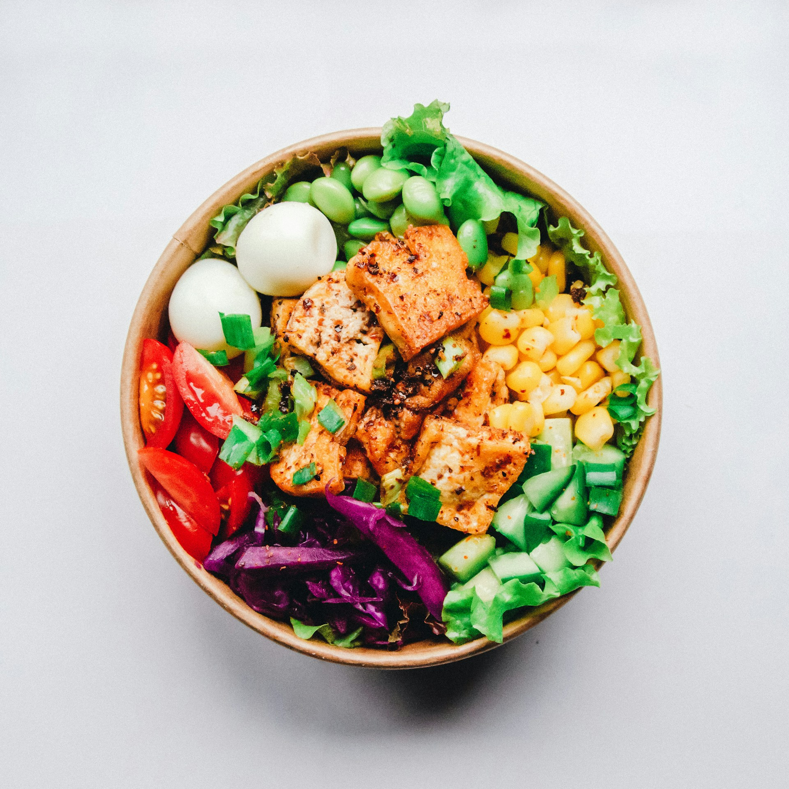

# 🍽️ Restaurant Website

A modern, responsive restaurant landing page built with **HTML5** and **CSS3**. This single-page website showcases a clean, visually appealing design perfect for restaurants, cafes, or food-related businesses.



## ✨ Features

- **Navigation Bar** — Clean header with logo and navigation links (HOME, CONTACT, ABOUT, LOGIN)
- **Hero Section** — Eye-catching hero image with a "Get 50% Discount" call-to-action and "Explore Now" button
- **Feature Cards** — Three key service highlights:
  - 🏷️ Discount Voucher
  - 🥗 Healthy Food
  - 🚚 Fast Home Delivery
- **Menu Gallery** — A beautiful 3-column grid layout showcasing 6 food images
- **Footer** — Contains main links, support section, newsletter signup, and social media icons (Facebook, Instagram, Twitter, LinkedIn)
- **Hover Effects** — Interactive hover states on buttons, navigation links, and social icons

## 🛠️ Tech Stack

- **HTML5** — Semantic markup structure
- **CSS3** — Flexbox & Grid layouts, hover transitions, responsive styling
- **Font Awesome** — Social media icons (v6 via CDN)

## 📁 Project Structure

```
📦 restaurant-website/
├── 📄 index.html          # Main HTML file
├── 📄 style.css           # All styles and layout
├── 📄 README.md           # Project documentation
├── 📁 images/
│   ├── logo.png           # Primary logo
│   ├── logo-1.png         # Secondary logo (used in navbar & footer)
│   ├── hero-image.jpg     # Hero section background
│   ├── image-1.jpg        # Menu gallery image 1
│   ├── image-2.jpg        # Menu gallery image 2
│   ├── image-3.jpg        # Menu gallery image 3
│   ├── image-4.jpg        # Menu gallery image 4
│   ├── image-5.jpg        # Menu gallery image 5
│   ├── image-6.jpg        # Menu gallery image 6
│   ├── discount-icon.png  # Discount voucher feature icon
│   ├── cart-icon.png      # Healthy food feature icon
│   └── home-icon.png      # Fast home delivery feature icon
```

## 🚀 Getting Started

1. **Clone the repository**
   ```bash
   git clone https://github.com/Muhammadwaseemgtk/restaurant-website.git
   ```

2. **Open in browser**
   - Simply open `index.html` in your preferred browser.
   - No build tools, dependencies, or server setup required.

## 🎨 Sections Overview

| Section | Description |
|---------|-------------|
| **Navbar** | Fixed-top navigation with logo and page links |
| **Hero** | Large hero image with discount badge, headline, and CTA button |
| **Features** | Three-column feature row highlighting services |
| **Menu Gallery** | Grid-based photo gallery of food items |
| **Footer** | Multi-column footer with links, newsletter, and social icons |

## 🔮 Future Enhancements

- [ ] Add responsive design for mobile and tablet devices
- [ ] Implement interactive menu with dish descriptions and prices
- [ ] Add reservation booking form
- [ ] Integrate JavaScript for form validation and interactivity
- [ ] Add dark/light theme toggle
- [ ] Include customer testimonials carousel
- [ ] Add Google Maps embed for restaurant location

## 📄 License

This project is open source and available under the [MIT License](LICENSE).

---

<p align="center">Made with ❤️ by Muhammad Waseem</p>
